# Task Management Microservice System

### 👥 Team Members:

| First & Last Name | Student Number |  
|---|---|
| Hasibullah Mohamand  | 221307114 |
| Aboubacar Sow | 221307117 |

**Date:** March 2026  
**Repository:** https://github.com/username/task-management-system.git

---

## Table of Contents
1. [Introduction](#1-introduction)
2. [System Design & Architecture](#2-system-design--architecture)
3. [Project Structure & Modules](#3-project-structure--modules)
4. [Application Screenshots & Test Results](#4-application-screenshots--test-results)
5. [Conclusion & Discussion](#5-conclusion--discussion)
6. [References](#6-references)

---

## 1. Introduction

### Problem Definition

Modern software systems face increasing demands for scalability, maintainability, and resilience. Traditional monolithic architectures struggle to meet these demands as applications grow in complexity — a single failure can bring down the entire system, deployments require taking the whole application offline, and scaling individual components is impossible without scaling everything.

### Purpose

The goal of this project is to design and implement a distributed **Task Management System** using a **microservice architecture** where teams can:
- Create and manage projects with full lifecycle management
- Assign and track tasks across projects
- Receive AI-powered task assistance via an intelligent agent service
- Authenticate securely via industry-standard OAuth2/OIDC
- Monitor system health and performance in real time

### Why Microservices?

| Benefit | Description |
|---|---|
| Independent deployment | Each service can be updated without affecting others |
| Technology diversity | .NET 9 for business services, Python/FastAPI for AI and user services |
| Fault isolation | A failure in one service does not bring down the entire system |
| Scalability | Individual services can be scaled independently based on load |
| Team autonomy | Different teams can own different services independently |

---

## 2. System Design & Architecture

### 2.1 Richardson Maturity Model

The Richardson Maturity Model defines four levels of REST API maturity:

| Level | Name | Description |
|---|---|---|
| 0 | The Swamp of POX | Single URI, single HTTP method |
| 1 | Resources | Multiple URIs representing resources |
| 2 | HTTP Verbs | Use of HTTP methods (GET, POST, PUT, PATCH, DELETE) |
| 3 | Hypermedia Controls | HATEOAS — responses include links to related actions |

**This project targets Level 2** — each resource has its own URI and uses the correct HTTP verbs:

```
GET    /projects                          → list all projects
POST   /projects                          → create a project
PATCH  /projects/{id}                     → update a project (partial)
PATCH  /projects/{id}/complete            → complete a project
PATCH  /projects/{id}/on-hold             → put project on hold
PATCH  /projects/{id}/reactivate          → reactivate a project
PATCH  /projects/{id}/archive             → archive a project
GET    /tasks                             → list all tasks
POST   /tasks                             → create a task
PATCH  /tasks/{id}                        → update a task
POST   /agent/generate_description        → generate project description
POST   /agent/suggest_tasks               → suggest tasks for a project
POST   /agent/refine_project_name         → refine project name
```

### 2.2 What is a RESTful Service?

A RESTful service is a web service that follows REST (Representational State Transfer) architectural constraints:

- **Stateless** — each request contains all information needed to process it, no session state on server
- **Uniform Interface** — consistent resource-based URIs with standard HTTP methods
- **Client-Server** — clear separation between UI concerns and data storage
- **Cacheable** — responses define themselves as cacheable or non-cacheable
- **Layered System** — client cannot tell whether connected directly to end server or intermediary

### 2.3 Microservice Architecture Overview

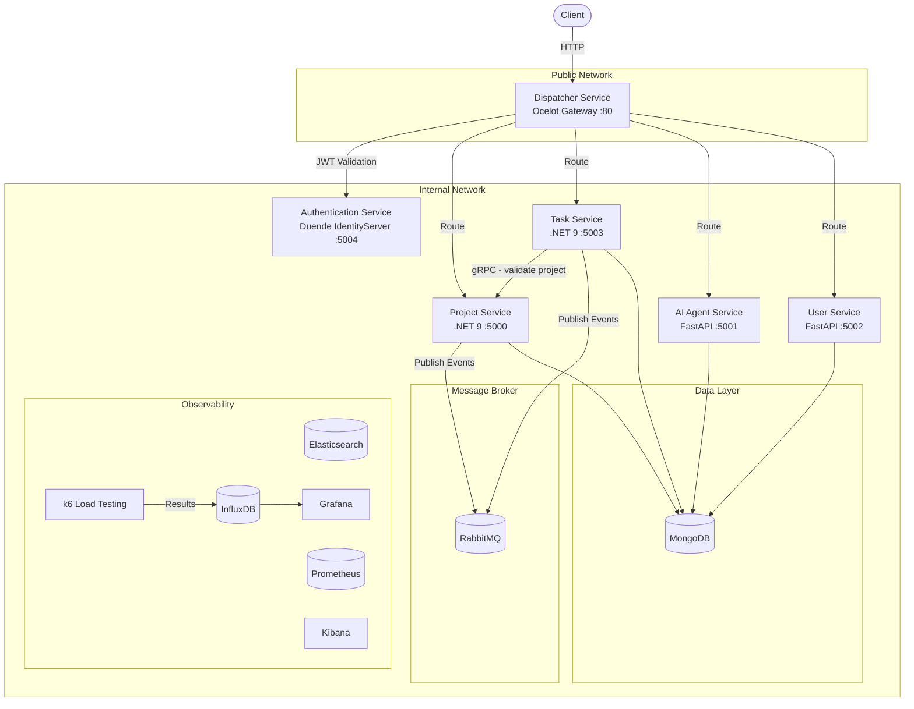

### 2.4 Authentication Flow

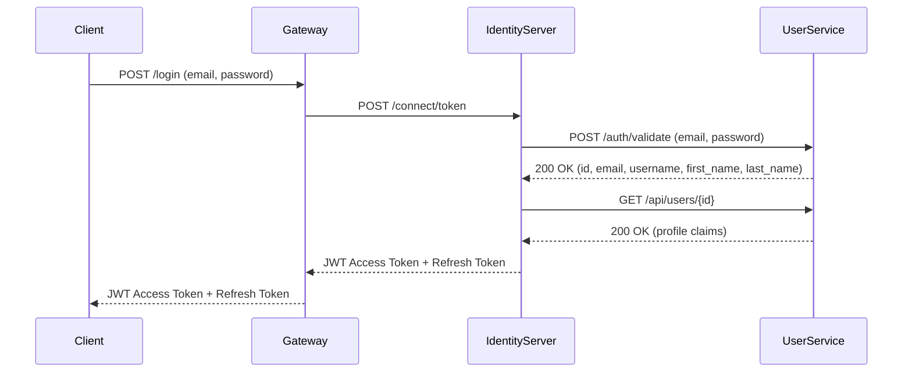

### 2.5 Agent Flow
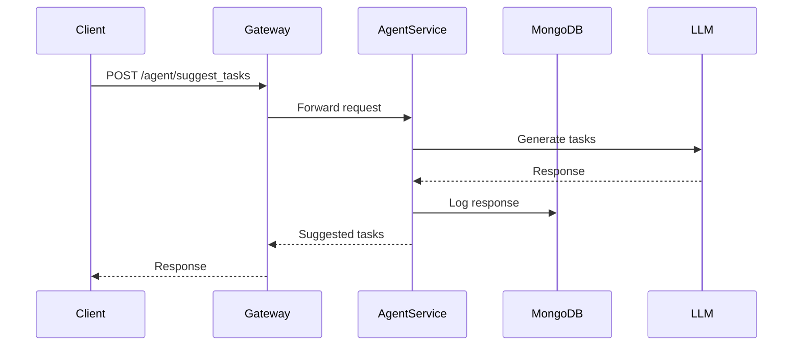

### 2.6 User Flow

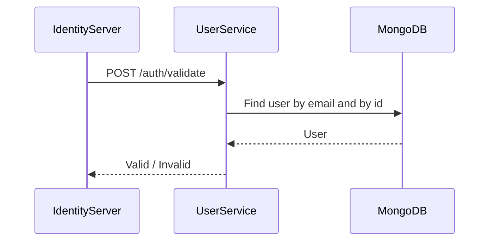

### 2.7 Request Flow Through Gateway

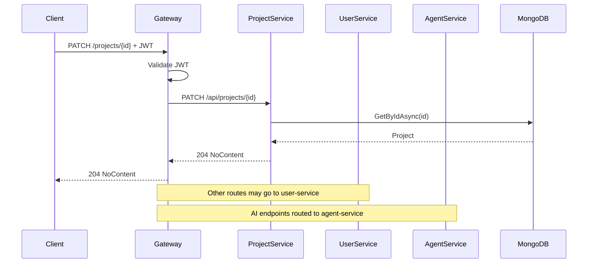

### 2.8 Token Refresh Flow

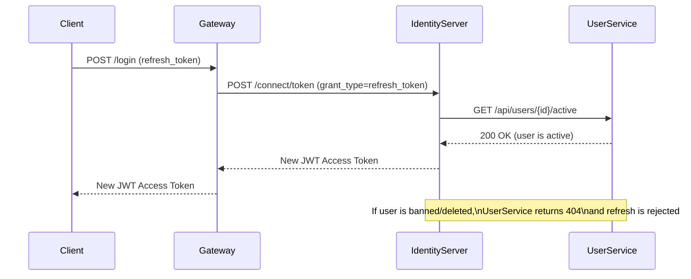

### 2.9 gRPC Communication — Task Service → Project Service

When a task is created, `task-service` validates the referenced project via **gRPC** instead of REST because:

- Faster than HTTP/JSON for internal service-to-service calls
- Strongly typed contracts via Protocol Buffers — no runtime deserialization errors
- Built-in code generation for both client and server
- Bidirectional streaming support for future use cases

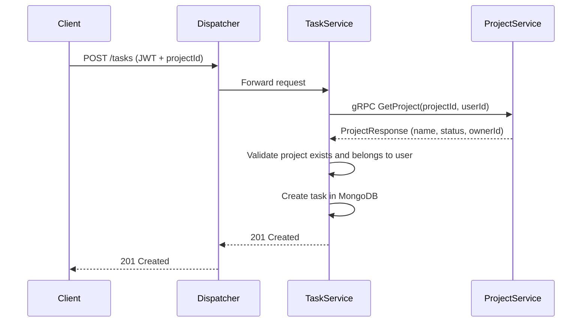

**Proto contract:**

```protobuf
syntax = "proto3";

package projectservice;

service ProjectGrpc {
  rpc GetProject (GetProjectRequest) returns (GetProjectResponse);
}

message GetProjectRequest {
  string project_id = 1;
  string user_id    = 2;
}

message GetProjectResponse {
  string project_id = 1;
  string name       = 2;
  string status     = 3;
  string owner_id   = 4;
}
```

### 2.10 Event-Driven Communication via RabbitMQ

Services communicate asynchronously through RabbitMQ — publishers do not need to know about consumers:

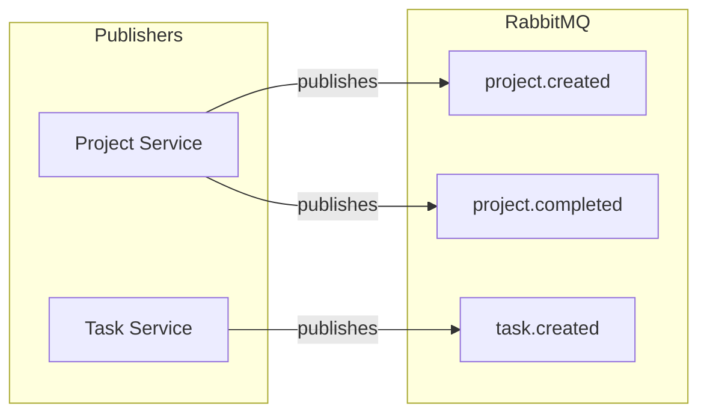

### 2.11 Project State Machine

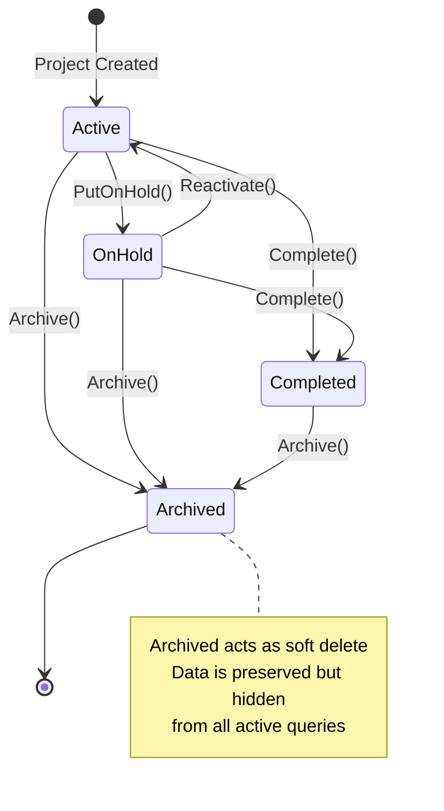

### 2.12 Dispatcher Middleware Pipeline

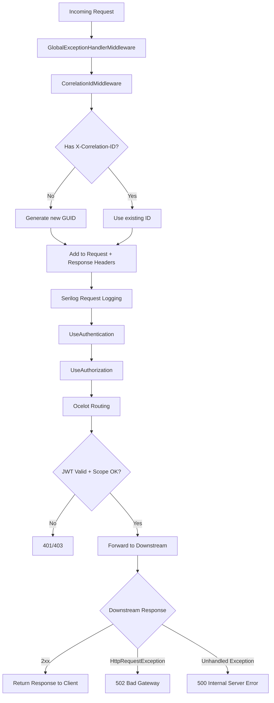

### 2.13 Class Structure

#### Project Aggregate

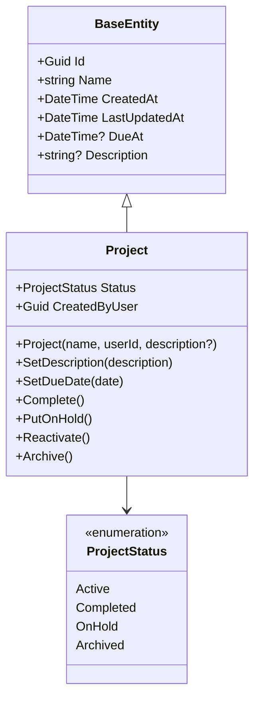

#### CQRS Pattern

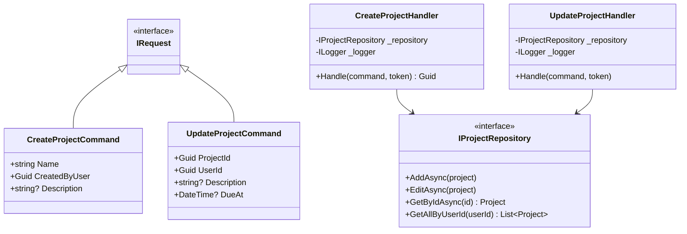

### 2.14 Complexity Analysis

| Operation | Time Complexity | Space Complexity | Notes |
|---|---|---|---|
| Create Project | O(1) | O(1) | Single MongoDB insert with generated UUID |
| Get Project by ID | O(1) | O(1) | MongoDB indexed by `_id` |
| Get Projects by User | O(n) | O(n) | n = number of user's projects |
| Update Project | O(1) | O(1) | MongoDB `ReplaceOne` by ID |
| Project State Transition | O(1) | O(1) | Simple status check + assignment |
| JWT Validation | O(1) | O(1) | Cryptographic signature verification |
| Correlation ID Generation | O(1) | O(1) | `Guid.NewGuid()` |
| Route Matching (Ocelot) | O(r) | O(1) | r = number of configured routes |

### 2.15 Literature Review

**Microservices Architecture** (Newman, 2015) — foundational reference defining microservices as small, independently deployable services organized around business capabilities. Influenced the service decomposition strategy — each service owns its data store and exposes a well-defined API.

**Domain-Driven Design** (Evans, 2003) — influenced the aggregate design. `Project` is the aggregate root with encapsulated state transitions (`Complete()`, `Archive()`, etc.) enforcing business invariants at the domain model level rather than in application services.

**CQRS Pattern** (Young, 2010) — commands (write) and queries (read) are separated using MediatR. This improves scalability since read and write workloads can be optimized independently, and improves maintainability through single-responsibility handlers.

**Test-Driven Development** (Beck, 2002) — all business logic is written test-first following the Red → Green → Refactor cycle. This ensures correctness, enables safe refactoring, and serves as living documentation of expected behavior.

**OAuth2 + OIDC** (RFC 6749, RFC 7519) — industry standard for authentication and authorization. Implemented via Duende IdentityServer with the Resource Owner Password flow for user login and Client Credentials for service-to-service communication.

**The Twelve-Factor App** (Wiggins, 2011) — configuration is externalized via environment variables and `appsettings.{Environment}.json`, backing services (MongoDB, RabbitMQ) are treated as attached resources, and logs are treated as event streams via Serilog.

**FastAPI Framework** (Ramirez, 2018) — FastAPI is a modern, high-performance web framework for building APIs with Python based on standard Python type hints. It provides automatic validation via Pydantic, asynchronous request handling, and built-in OpenAPI documentation. It was used for the user-service and ai-agent-service due to its rapid development capabilities and strong validation support.

**Pydantic Data Validation** (Colvin, 2017) — Pydantic enables data parsing and validation using Python type annotations. It ensures that all incoming API requests conform to expected schemas, reducing runtime errors and improving API reliability. It is heavily used in both FastAPI-based services.

**Large Language Models (LLMs)** — Recent advances in transformer-based models (Vaswani et al., 2017) have enabled natural language understanding and generation capabilities. The ai-agent-service integrates a local LLM via Ollama to provide intelligent task suggestions and project descriptions, demonstrating the application of AI within microservice architectures.

**Ollama Local LLM Serving** — Ollama enables running large language models locally without cloud dependency, providing privacy, low latency, and offline capabilities. It was used to integrate AI functionality into the system without external API reliance.

---

## 3. Project Structure & Modules

### 3.1 Solution Structure

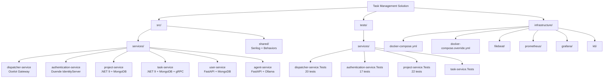

### 3.2 Service Responsibilities

| Service | Technology | Responsibility | Status |
|---|---|---|---|
| `dispatcher-service` | .NET 9 + Ocelot | API Gateway, JWT validation, routing, correlation ID, exception handling | ✅ Done |
| `authentication-service` | .NET 9 + Duende IdentityServer | Token issuance, credential delegation to FastAPI, refresh token validation | ✅ Done |
| `project-service` | .NET 9 + MongoDB + gRPC server | Project CRUD, state machine, ownership enforcement, gRPC server | ✅ Done |
| `task-service` | .NET 9 + MongoDB + gRPC client | Task CRUD, project validation via gRPC, event publishing | 🔄 In Progress |
| `user-service` | FastAPI + MongoDB | User registration, credential validation, profile management | ✅ Done |
| `ai-agent-service` | FastAPI + MongoDB + Ollama | AI-powered project description generation, task suggestion, and project name refinement via llama3.2 | ✅ Done |

### 3.3 Dispatcher Middleware

| Middleware | Order | Responsibility |
|---|---|---|
| `GlobalExceptionHandlerMiddleware` | 1st — outermost | Catches all unhandled exceptions, returns 500 or 502 |
| `CorrelationIdMiddleware` | 2nd | Generates/forwards `X-Correlation-ID` header |
| `SerilogRequestLogging` | 3rd | Logs method, path, status code, duration |
| `UseAuthentication` | 4th | Validates JWT signature against IdentityServer |
| `UseAuthorization` | 5th | Enforces scope-based access |
| `Ocelot` | 6th — innermost | Routes to downstream services |

### 3.4 User Service

The user-service is implemented in FastAPI and backed by MongoDB. It is responsible for:

- registering new users
- retrieving and updating user profiles
- validating email/password credentials for the authentication service
- exposing user claim data such as sub, email, given_name, and family_name
- checking whether a user is active during refresh token validation

Unlike the .NET business services, the user-service follows a lightweight Python architecture with:

- Pydantic models for request/response validation
- repository abstraction for data access
- service layer for business rules
- pytest-based unit and API tests

### 3.5 AI Agent Service

The ai-agent-service is implemented in FastAPI and integrates with a local Ollama model (llama3.2) to provide AI-assisted productivity features. This service is stateless and can be scaled independently depending on LLM workload. It exposes endpoints such as:

- POST /agent/generate_description
- POST /agent/suggest_tasks
- POST /agent/refine_project_name

Its responsibilities include:

- generating project descriptions from short prompts
- suggesting task lists for project planning
- refining project names into clearer and more professional forms
- logging generated responses into MongoDB for traceability and future analysis

The service is designed as a lightweight Python microservice with:

- FastAPI routing
- Pydantic request/response models
- a dedicated agent/service layer
- MongoDB-backed logging
- pytest-based validation and API tests

### 3.6 TDD Approach

All business logic follows the Red → Green → Refactor cycle:

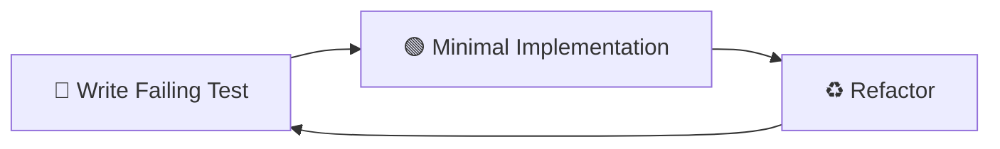

**Test Coverage:**

| Service | Test Classes | Total Tests | Coverage Areas |
|---|---|---|---|
| `authentication-service.Tests` | 2 | 17 | Credential validation, profile claims, active check |
| `project-service.Tests` | 4 | 22 | Handler logic, validation, model state transitions |
| `dispatcher-service.Tests` | 3 | 20 | Middleware behavior, Ocelot config validation |
| `user_service.Tests` | 2 | 22 | User CRUD behavior, Api validation |
| `ai_agent_service.Tests` | 2 | 6 | Agent behavior, Api validation |
| **Total** | **13** | **87** | |

### 3.7 Observability Stack

| Tool | Role | Access |
|---|---|---|
| **Serilog** | Structured logging in all .NET services | — |
| **Python logging** | Structured logging in all python services | — |
| **Filebeat** | Ships container logs to Elasticsearch | — |
| **Elasticsearch** | Log storage and indexing | `localhost:9200` |
| **Kibana** | Log visualization and search | `localhost:5601` |
| **prometheus-net** | Exposes `/metrics` in all .NET services | — |
| **Prometheus** | Scrapes and stores metrics | `localhost:9090` |
| **Grafana** | Metrics and log dashboards | `localhost:3000` |
| **InfluxDB** | Stores k6 load test results | `localhost:8086` |
| **k6** | Load testing tool | — |

---

## 4. Application Screenshots & Test Results

### 4.1 Authentication — Token Request

<p align="center">
  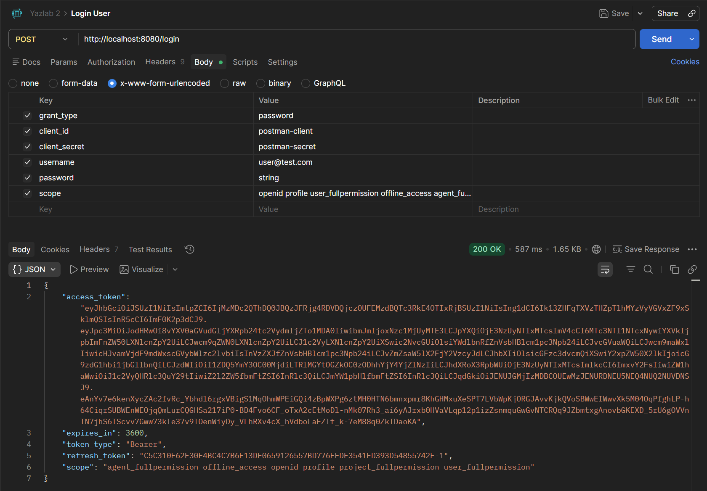
</p>
<p align="center">
  <b>Figure 1:</b> Postman POST /login returning JWT access token and refresh token
</p>

### 4.2 JWT Claims — Decoded Token

<p align="center">
  
</p>
<p align="center">
  <b>Figure 2:</b> jwt.io showing decoded token with sub, email, given_name, family_name, scope claims
</p>

### 4.3 Project Operations
<p align="center">
  
</p>
<p align="center">
  <b>Figure 3:</b> Postman POST /projects returning 201 Created
</p>
<p align="center">
  
</p>
<p align="center">
  <b>Figure 4:</b> Postman PATCH /projects/{id} returning 204 NoContent
</p>
<p align="center">
  
</p>
<p align="center">
  <b>Figure 5:</b>  Postman PATCH /projects/{id}/complete returning 204 NoContent
</p>

### 4.4 Agent Operations
<p align="center">
  
</p>
<p align="center">
  <b>Figure 6:</b> Postman POST /agent/generate_description returning 200 OK
</p>
<p align="center">
  
</p>
<p align="center">
  <b>Figure 7:</b> Postman POST /agent/suggest_tasks returning 200 OK
</p>
<p align="center">
  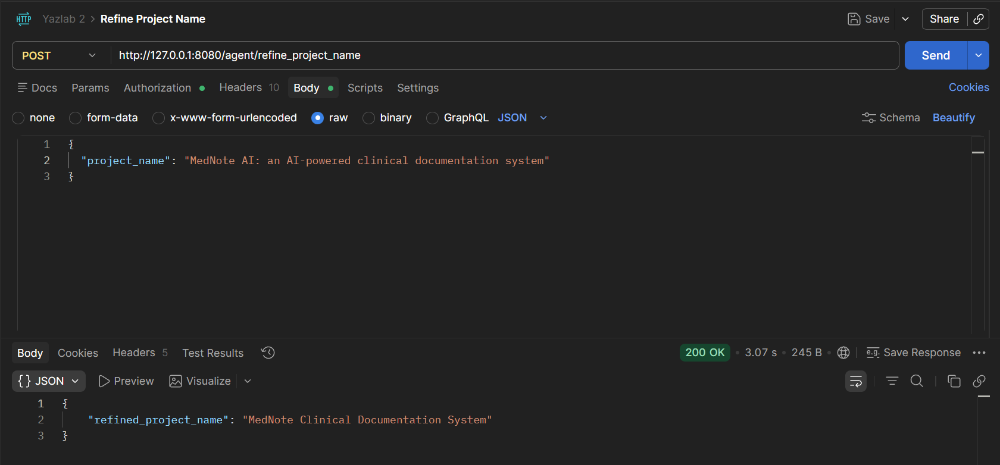
</p>
<p align="center">
  <b>Figure 8:</b>  Postman POST /agent/refine_project_name returning 200 OK
</p>

### 4.5 Unit Test Results

#### Authentication Service — 17 Tests ✅
<p align="center">
  
</p>
<p align="center">
  <b>Figure 9:</b>   dotnet test output — all GREEN
</p>

#### Project Service — 22 Tests ✅
<p align="center">
  
</p>
<p align="center">
  <b>Figure 10:</b>  dotnet test output — all GREEN
</p>

#### Dispatcher Service — 20 Tests ✅
<p align="center">
  
</p>
<p align="center">
  <b>Figure 11:</b>   dotnet test output — all GREEN
</p>

#### User Service — 22 Tests ✅
<p align="center">
  
</p>
<p align="center">
  <b>Figure 12:</b>   pytest test output — all GREEN
</p>

#### AI Agent Service — 6 Tests ✅
<p align="center">
  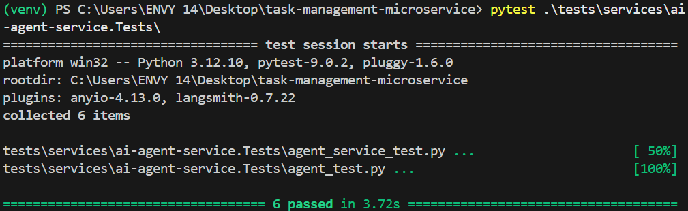
</p>
<p align="center">
  <b>Figure 13:</b>   pytest test output — all GREEN
</p>

### 4.6 Load Test Results

Tests performed using **k6** against the dispatcher service. Each scenario runs for 2 minutes at the specified concurrent user count.


**Results:**

| Concurrent Users | Avg Response (ms) | p95 Response (ms) | Error Rate | Throughput (req/s) |
|---|---|---|---|---|
| 50 | TBD | TBD | TBD | TBD |
| 100 | TBD | TBD | TBD | TBD |
| 200 | TBD | TBD | TBD | TBD |
| 500 | TBD | TBD | TBD | TBD |
<p align="center">
  
</p>
<p align="center">
  <b>Figure 14:</b>  Grafana k6 dashboard — real-time metrics during load test
</p>


### 4.6 Observability
<p align="center">
  
</p>
<p align="center">
  <b>Figure 15:</b>  Kibana — structured logs with X-Correlation-ID across services
</p>
<p align="center">
  
</p>
<p align="center">
  <b>Figure 16:</b>  Grafana — service metrics dashboard (request rate, latency, errors)
</p>
<p align="center">
  
</p>
<p align="center">
  <b>Figure 17:</b>  Prometheus — targets page showing all services UP
</p>

---

## 5. Conclusion & Discussion

### Achievements

- ✅ Full microservice architecture with 6 independent services
- ✅ Single entry point via Ocelot gateway with JWT validation and scope enforcement
- ✅ Centralized authentication with Duende IdentityServer delegating to FastAPI
- ✅ TDD across all .NET and Python services — 87+ passing tests
- ✅ Rich domain model — project state machine with business rules enforced at model level
- ✅ CQRS pattern with MediatR — clean separation of commands and queries
- ✅ Distributed tracing via correlation IDs across all services
- ✅ Full observability stack — Elasticsearch, Kibana, Prometheus, Grafana
- ✅ Load testing with k6 — validated at 50, 100, 200, 500 concurrent users
- ✅ Fully containerized with Docker — reproducible across all environments
- ✅ gRPC for high-performance service-to-service communication
- ✅ Event-driven architecture with RabbitMQ for async service communication

### Limitations

- ❌ **No HTTPS** — services communicate over HTTP internally. Production requires TLS termination at the gateway
- ❌ **IdentityServer signing keys not persisted** — keys are lost on restart without a persistent key store
- ❌ **In-memory IdentityServer config** — clients and scopes are hardcoded. Production should use a database-backed config store with EF Core
- ❌ **No circuit breaker** — if a downstream service goes down, requests fail without fallback or retry
- ❌ **No API versioning** — breaking changes affect all clients immediately
- ❌ **Single MongoDB instance** — no replication or sharding. Production requires a MongoDB replica set

### Possible Improvements

- **HTTPS** — add TLS termination at the gateway with Let's Encrypt
- **Circuit breaker** — add Polly for resilience, retry policies, and fallback responses
- **Persistent IdentityServer config** — move clients/scopes to database with EF Core
- **API versioning** — introduce `/v1/`, `/v2/` route prefixes for safe evolution
- **Redis caching** — cache frequently accessed project data to reduce MongoDB load
- **Health checks** — add `/health` endpoints to all services for Docker and Kubernetes monitoring
- **Kubernetes** — migrate from docker-compose to Kubernetes for production-grade orchestration
- **Saga pattern** — handle distributed transactions across services with compensating transactions
- **Event sourcing** — store all domain events for complete audit trail and temporal queries
- **HATEOAS** — evolve to Richardson Maturity Level 3 with self-describing API responses

---

## 6. References

- Newman, S. (2015). *Building Microservices*. O'Reilly Media.
- Evans, E. (2003). *Domain-Driven Design: Tackling Complexity in the Heart of Software*. Addison-Wesley.
- Beck, K. (2002). *Test-Driven Development: By Example*. Addison-Wesley.
- Wiggins, A. (2011). *The Twelve-Factor App*. https://12factor.net
- Richardson, L. (2008). *Richardson Maturity Model*. https://martinfowler.com/articles/richardsonMaturityModel.html
- IETF RFC 6749 — *The OAuth 2.0 Authorization Framework*
- IETF RFC 7519 — *JSON Web Token (JWT)*
- Duende Software. (2024). *Duende IdentityServer Documentation*. https://docs.duendesoftware.com
- Ocelot. (2024). *Ocelot API Gateway Documentation*. https://ocelot.readthedocs.io
- Grafana Labs. (2024). *k6 Load Testing Documentation*. https://k6.io/docs
- Prometheus. (2024). *Prometheus Documentation*. https://prometheus.io/docs
- MediatR. (2024). *MediatR Documentation*. https://github.com/jbogard/MediatR
- Serilog. (2024). *Serilog Documentation*. https://serilog.net
- Ramirez, S. (2018). *FastAPI Documentation*. https://fastapi.tiangolo.com
- Colvin, S. (2017). *Pydantic Documentation*. https://docs.pydantic.dev
- Vaswani, A., et al. (2017). *Attention is All You Need*. Advances in Neural Information Processing Systems.
- Ollama. (2024). *Ollama Documentation*. https://ollama.com