# 🧩 Task Management Microservice System

> A production-grade distributed task management platform built with microservices, AI-powered assistance, and full observability.

<div align="center">


**376 passing tests · 6 independent services · Full observability stack · AI-powered agent**

</div>

---

## 👥 Team

| First & Last Name | Student Number |
|------|---------------|
| Hasibullah Mohamand | 221307114 |
| Aboubacar Sow | 221307117 |

📅 **March 2026** · 📁 [Repository](https://github.com/AboubacarSow/task-management-system.git)

---

## 📋 Table of Contents

1. [What Is This?](#-what-is-this)
2. [Tech Stack](#-tech-stack)
3. [Architecture](#-architecture)
4. [Services at a Glance](#-services-at-a-glance)
5. [API Reference](#-api-reference)
6. [Getting Started](#-getting-started)
7. [Running Tests](#-running-tests)
8. [Load Testing](#-load-testing)
9. [Observability](#-observability)
10. [Key Design Decisions](#-key-design-decisions)
11. [Known Limitations & Roadmap](#-known-limitations--roadmap)
12. [References](#-references)

---

## 🎯 What Is This?

A fully containerized **distributed task management system** that demonstrates real-world microservice architecture patterns:

- 🔐 **Secure authentication** via OAuth2/OIDC with Duende IdentityServer
- 📋 **Project & task management** with a rich domain model and state machine
- 🤖 **AI-powered assistance** — generate descriptions, suggest tasks, and refine project names using a local LLM (llama3.2 via Ollama)
- 📡 **Mixed communication** — synchronous gRPC for internal service calls, async RabbitMQ for event-driven workflows
- 🔭 **Full observability** — structured logging, metrics, distributed tracing with correlation IDs

---

## 🛠 Tech Stack

### Services
| Layer | Technology | Purpose |
|-------|-----------|---------|
| API Gateway | .NET 9 + Ocelot | Request routing, JWT validation, correlation IDs |
| Auth | .NET 9 + Duende IdentityServer | OAuth2/OIDC token issuance & refresh |
| Project Service | .NET 9 + MongoDB + gRPC | Project CRUD, state machine, gRPC server |
| Task Service | .NET 9 + MongoDB + gRPC | Task CRUD, event publishing |
| User Service | Python + FastAPI + MongoDB | User registration, profile management |
| AI Agent | Python + FastAPI + Ollama + MongoDB | LLM-powered productivity features |

### Infrastructure
| Tool | Role |
|------|------|
| MongoDB | Per-service data store (no shared DB) |
| RabbitMQ | Async event bus between services |
| gRPC + Protobuf | Fast, strongly typed internal RPC |
| Docker Compose | Full-stack local orchestration |

### Observability
| Tool | Role | URL |
|------|------|-----|
| Serilog / Python logging | Structured logs | — |
| Filebeat → Elasticsearch | Log shipping & storage | `localhost:9200` |
| Kibana | Log visualization & search | `localhost:5601` |
| prometheus-net → Prometheus | Metrics scraping | `localhost:9090` |
| Grafana | Dashboards | `localhost:3000` |
| InfluxDB + k6 | Load test results | `localhost:8086` |

### Testing
| Layer | Framework |
|-------|----------|
| .NET unit & integration tests | xUnit |
| Python unit & API tests | pytest |
| Load testing | k6 |

---

## 🏗 Architecture

### High-Level Overview

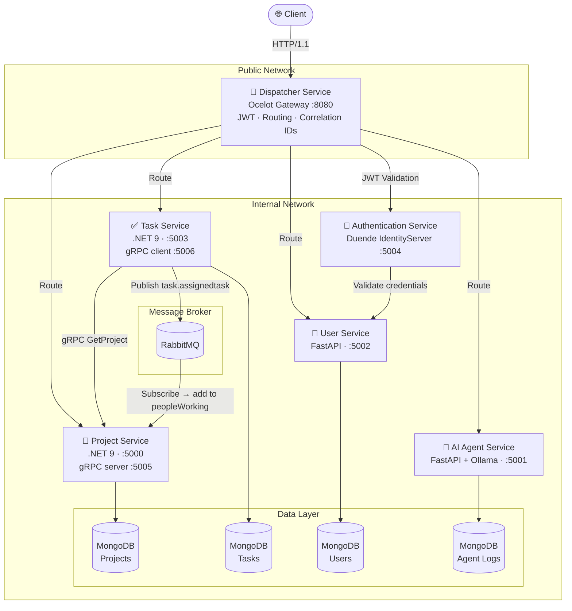

### Communication Patterns

| Pattern | Where Used | Why |
|---------|-----------|-----|
| **HTTP/REST** | Client → Gateway → Services | Standard, browser-compatible |
| **gRPC** | Task Service → Project Service | Fast, type-safe, no JSON overhead |
| **RabbitMQ** | Task publishes → Project consumes | Decoupled, non-blocking |
| **JWT** | All authenticated requests | Stateless, verifiable tokens |

### Authentication Flow

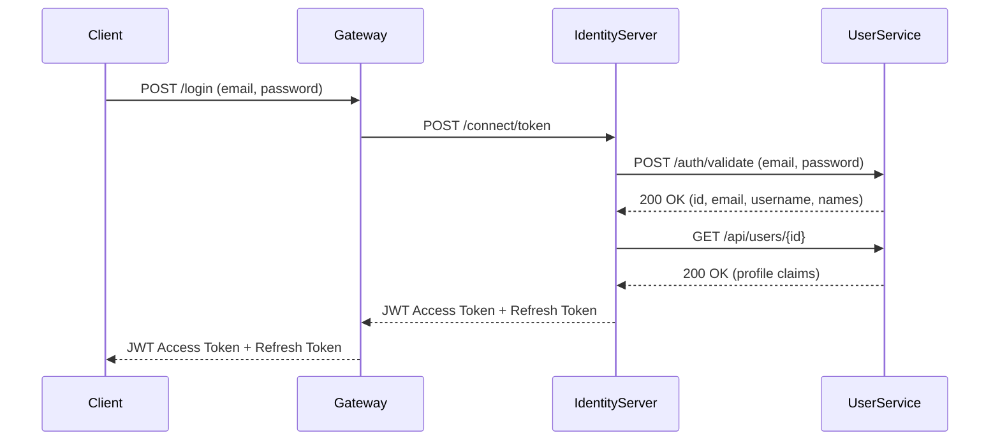

### Task Creation via gRPC

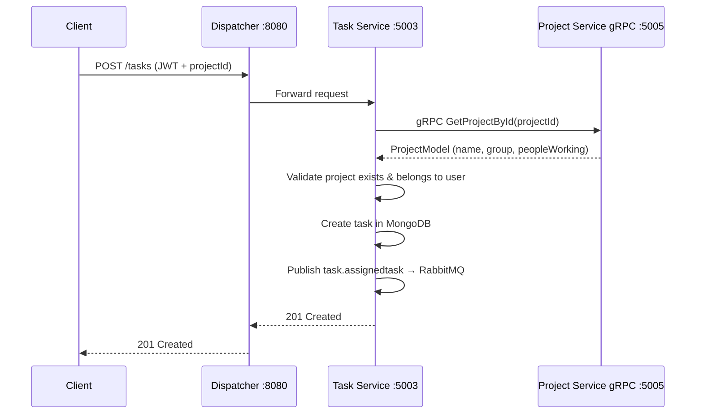

### Project State Machine

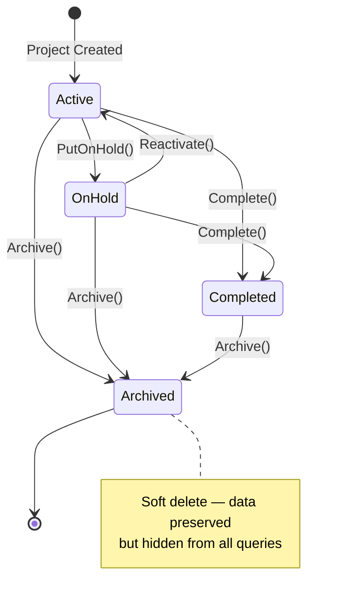

### gRPC Contracts

#### Task → Project

```protobuf
service ProjectInfo {
  rpc GetProjectById (GetProjectRequest) returns (ProjectModel);
}

message ProjectModel {
  string id            = 1;
  string name          = 2;
  string ownerId       = 3;
  repeated string group         = 4;
  repeated string peopleWorking = 5;
}
```

#### Project → Task

```protobuf
package task;

service TaskInfo {
  rpc GetTaskById (GetTaskRequest) returns (TaskModel);
}

message GetTaskRequest {
  string projectId = 1;
}

message TaskModel {
  bool allCompleted = 1;
}
```

---

## 🔌 Services at a Glance

| Service | Port | Status | Key Features |
|---------|------|--------|-------------|
| `dispatcher-service` | 8080 | ✅ Done | Ocelot gateway, JWT, correlation IDs, exception middleware |
| `authentication-service` | 5004 | ✅ Done | OAuth2 + OIDC, token issuance, refresh validation |
| `project-service` | 5000 / gRPC 5005 | ✅ Done | CRUD, state machine, DDD aggregates, CQRS with MediatR |
| `task-service` | 5003 / gRPC 5006 | ✅ Done | CRUD, gRPC client, event publishing |
| `user-service` | 5002 | ✅ Done | Registration, profile, credential validation |
| `ai-agent-service` | 5001 | ✅ Done | LLM-powered description, task suggestion, name refinement |

### Dispatcher Middleware Pipeline

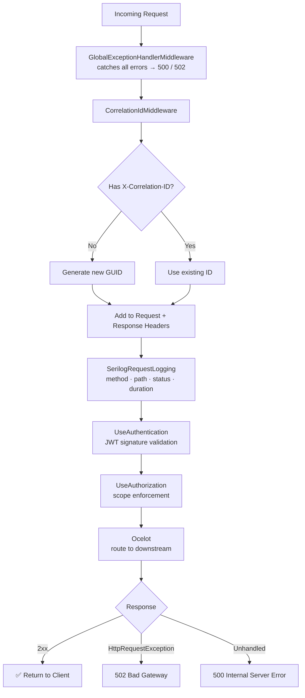

---

## 📡 API Reference

### Authentication
| Method | Endpoint | Description |
|--------|----------|-------------|
| `POST` | `/login` | Get JWT access token + refresh token |
| `POST` | `/login` (refresh_token grant) | Rotate refresh token |

### Projects
| Method | Endpoint | Description |
|--------|----------|-------------|
| `GET` | `/projects/me` | List all projects for authenticated user |
| `POST` | `/projects` | Create a new project |
| `PATCH` | `/projects/{id}` | Update project details |
| `PATCH` | `/projects/{id}/state` | Update project state (complete, hold, reactivate, archive) |
| `POST` | `/projects/{id}/group` | Add a user to the project group |

### Tasks
| Method | Endpoint | Description |
|--------|----------|-------------|
| `GET` | `/tasks` | List all tasks for authenticated user |
| `POST` | `/tasks` | Create a task (validates project via gRPC) |
| `PATCH` | `/tasks/{id}` | Update a task |

### AI Agent
| Method | Endpoint | Description |
|--------|----------|-------------|
| `POST` | `/agent/generate_description` | Generate a project description from a prompt |
| `POST` | `/agent/suggest_tasks` | Get AI-suggested task list for a project |
| `POST` | `/agent/refine_project_name` | Polish a project name using LLM |

> 🔓 **Public endpoints** (no token required): `POST /login` and `POST /users` (register).
> 🔒 **All other endpoints** require a valid JWT in the `Authorization: Bearer <token>` header.

---

## 🚀 Getting Started

### Prerequisites

| Tool | Version | Notes |
|------|---------|-------|
| Docker | 24+ | Required |
| Docker Compose | v2+ | Required |
| Ollama | Latest | Required for AI agent |
| .NET SDK | 9.0 | Only if running services locally |
| Python | 3.11+ | Only if running services locally |

### 1. Clone the repository

```bash
git clone https://github.com/AboubacarSow/task-management-system.git
cd task-management-system
```

### 2. Pull the LLM model (for AI agent)

```bash
ollama pull llama3.2
```

### 3. Start the full stack

```bash
make dev
```

This starts all 6 services, MongoDB instances, RabbitMQ, and the full observability stack via Docker Compose.

### 4. Verify everything is running

```bash
docker compose ps
```

You should see all 6 services and supporting infrastructure in `Up` state.

### 5. Get an access token

The `/login` endpoint uses **OAuth2 Resource Owner Password** flow with `application/x-www-form-urlencoded`:

```bash
curl -X POST http://localhost:8080/login \
  -H "Content-Type: application/x-www-form-urlencoded" \
  --data-urlencode "grant_type=password" \
  --data-urlencode "client_id=postman-client" \
  --data-urlencode "client_secret=postman-secret" \
  --data-urlencode "username=user@example.com" \
  --data-urlencode "password=string" \
  --data-urlencode "scope=openid profile project_fullpermission offline_access"
```

Use the returned `access_token` as `Authorization: Bearer <token>` for all subsequent requests.


*Postman: POST /login returning JWT access token and refresh token*


*jwt.io showing decoded token with `sub`, `email`, `given_name`, `family_name`, `scope` claims*

### Service URLs (local)

| Service | URL |
|---------|-----|
| API Gateway | http://localhost:8080 |
| Kibana | http://localhost:5601 |
| Grafana | http://localhost:3000 |
| Prometheus | http://localhost:9090 |
| RabbitMQ Management | http://localhost:15672 |
| Elasticsearch | http://localhost:9200 |
| InfluxDB | http://localhost:8086 |

---

## 🧪 Running Tests

### .NET Services (xUnit)

Run all .NET tests from the repository root:

```bash
dotnet test
```

Or target a specific service:

```bash
# Authentication Service (15 tests)
dotnet test tests/services/authentication-service.Tests/

# Project Service (157 tests)
dotnet test tests/services/project-service.Tests/

# Task Service (151 tests)
dotnet test tests/services/task-service.Tests/

# Dispatcher Service (25 tests)
dotnet test tests/services/dispatcher-service.Tests/
```

### Python Services (pytest)

```bash
# User Service (22 tests)
cd src/services/user-service
pip install -r requirements-test.txt
pytest

# AI Agent Service (6 tests)
cd src/services/agent-service
pip install -r requirements-test.txt
pytest
```

### Test Coverage Summary

| Service | Tests | Status |
|---------|-------|--------|
| `authentication-service` | 15 | ✅ All passing |
| `project-service` | 157 | ✅ All passing |
| `task-service` | 151 | ✅ All passing |
| `dispatcher-service` | 25 | ✅ All passing |
| `user-service` | 22 | ✅ All passing |
| `ai-agent-service` | 6 | ✅ All passing |
| **Total** | **376** | ✅ All passing |

### What's Tested

- **authentication-service** — credential validation, profile claims, active user check
- **project-service** — handler logic, validation, all state machine transitions
- **task-service** — handler logic, validation, all state machine transitions
- **dispatcher-service** — middleware behavior, Ocelot configuration, correlation ID generation
- **user-service** — CRUD behavior, API contract validation
- **ai-agent-service** — agent behavior, API endpoint validation

> All business logic follows the **Red → Green → Refactor** TDD cycle.

---

## 📈 Load Testing

Load tests run via **k6** against the dispatcher service. Results are streamed to InfluxDB and visualized in Grafana.

### Run a load test

```bash
make load-test-50    # 50 VUs, 2 minutes
make load-test-100   # 100 VUs, 2 minutes
make load-test-200   # 200 VUs, 2 minutes
make load-test-500   # 500 VUs ramp-up, 6m30s
```

### Test scenarios

Each fixed-VU scenario runs for **2 minutes** at steady state. Each virtual user runs `POST /projects` followed by `GET /projects/me` per iteration.

| VUs | Duration | Avg (ms) | p90 (ms) | p95 (ms) | Max (ms) | Throughput (req/s) | Error Rate | p95 < 2000ms |
|:---:|:--------:|:--------:|:--------:|:--------:|:--------:|:-----------------:|:----------:|:------------:|
| **50** | 2m00s | 2.96 | 6.03 | 8.55 | 24.19 | 49.8 | ~0% | ✅ |
| **100** | 2m00s | 3.53 | 7.92 | 12.64 | 36.64 | 99.5 | ~0% | ✅ |
| **200** | 2m00s | 3.01 | 6.98 | 10.05 | 71.90 | 199.1 | ~0% | ✅ |
| **500** | 6m30s | 2.61 | 4.88 | 7.87 | 517.98 | 195.4 | ~0% | ✅ |

> Throughput scales linearly with VUs at lower concurrency (49.8 → 99.5 → 199.1 req/s). Response time stays well under 13 ms p95 even at 500 VUs — all scenarios pass the `p(95) < 2000ms` threshold with a large margin.

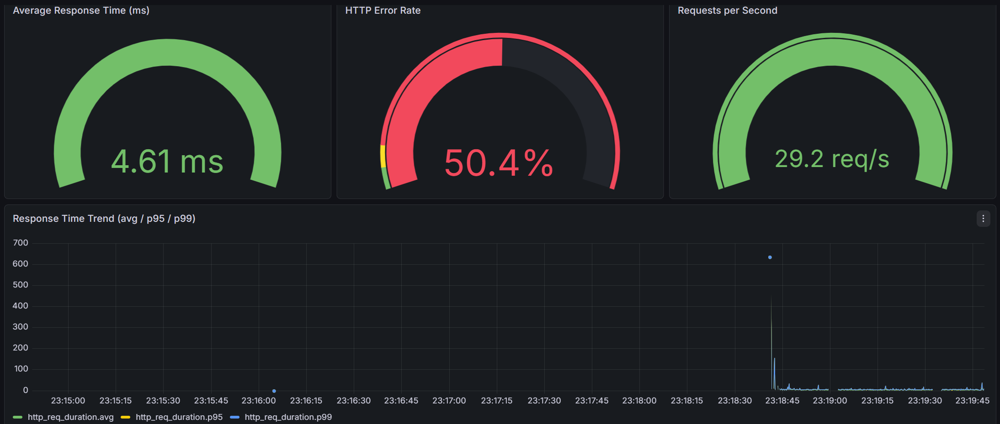
*Grafana k6 dashboard — Average Response Time · Error Rate · Throughput · VUs over time*

View live results at **http://localhost:3000** (Grafana → k6 dashboard).

---

## 🔭 Observability

### Distributed Tracing

Every request gets an `X-Correlation-ID` header — generated by the dispatcher if not present, and forwarded to all downstream services. This lets you trace a single request across all service logs in Kibana.

### Logs → Kibana

All services write structured logs. Filebeat ships container logs to Elasticsearch.

```
http://localhost:5601
```

Filter by `X-Correlation-ID` to trace a request end-to-end.

### Metrics → Grafana

All .NET services expose `/metrics` (via prometheus-net). Prometheus scrapes them every 15s. Grafana dashboards show:

- Request rate per service
- Average & p95 response time
- Error rates
- k6 load test results (via InfluxDB)

```
http://localhost:3000
```

### Prometheus Targets

```
http://localhost:9090/targets
```

All services should show `UP`.

---

## 🏛 Key Design Decisions

### Why gRPC for Task → Project?

When a task is created, the task service needs to verify the referenced project exists and belongs to the user. gRPC gives us:
- **~3× faster** than HTTP/JSON for internal calls
- **Compile-time safety** via Protocol Buffers — no runtime deserialization errors
- **Clear contracts** — the `.proto` file is the single source of truth

### Why RabbitMQ for task assignment events?

When a user is assigned to a task, the project service needs to add them to `peopleWorking`. This doesn't need to be synchronous — using RabbitMQ means:
- Task service doesn't wait for project service
- If project service is down, the event is queued and processed when it recovers
- Services are truly decoupled

### Why CQRS with MediatR?

Commands (create, update, archive) and queries (list, get by ID) have very different performance and complexity profiles. Separating them means:
- Each handler has a single responsibility
- Read and write paths can be optimized independently
- Adding new operations doesn't touch existing handlers

### Richardson Maturity Level

This project targets **Level 2** — every resource has its own URI with proper HTTP verb semantics. HATEOAS (Level 3) is a possible future improvement.

### Per-service databases

Each service owns its own MongoDB instance. No shared databases. This enforces true service independence and prevents tight coupling at the data layer.

---

## ⚠️ Known Limitations & Roadmap

### Current Limitations

| Area | Issue |
|------|-------|
| **HTTPS** | Services communicate over HTTP internally. TLS termination needed in production. |
| **IdentityServer keys** | Signing keys are not persisted — lost on restart. |
| **Config store** | IdentityServer clients/scopes are hardcoded. Should be database-backed. |
| **Resilience** | No circuit breaker — downstream failures propagate immediately. |
| **API versioning** | No `/v1/` prefix — breaking changes affect all clients. |
| **MongoDB** | Single instance — no replication or sharding. |

### Planned Improvements

- [ ] TLS termination at gateway (Let's Encrypt)
- [ ] Polly circuit breaker + retry policies
- [ ] Persistent IdentityServer config with EF Core
- [ ] API versioning (`/v1/`, `/v2/`)
- [ ] Redis caching for hot project data
- [ ] `/health` endpoints + Docker/Kubernetes probes
- [ ] Kubernetes migration from docker-compose
- [ ] Saga pattern for distributed transactions
- [ ] Event sourcing for full audit trail
- [ ] HATEOAS (Richardson Level 3)

---

## 📸 Screenshots

### Project Operations


*POST /projects → 201 Created*


*PATCH /projects/{id} → 204 NoContent*

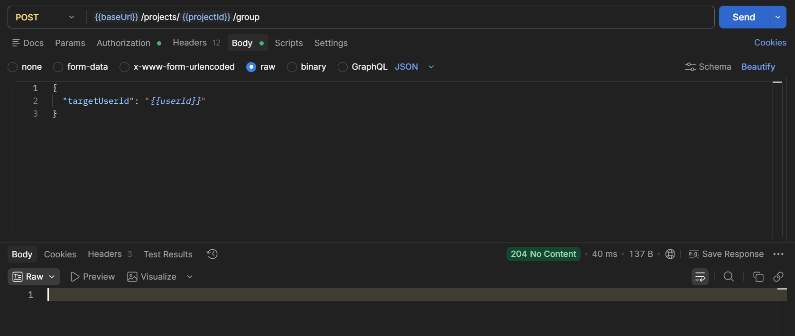
*POST /projects/{id}/group → 204 NoContent*

### AI Agent Operations


*POST /agent/generate_description → 200 OK*


*POST /agent/suggest_tasks → 200 OK*


*POST /agent/refine_project_name → 200 OK*

### Test Results

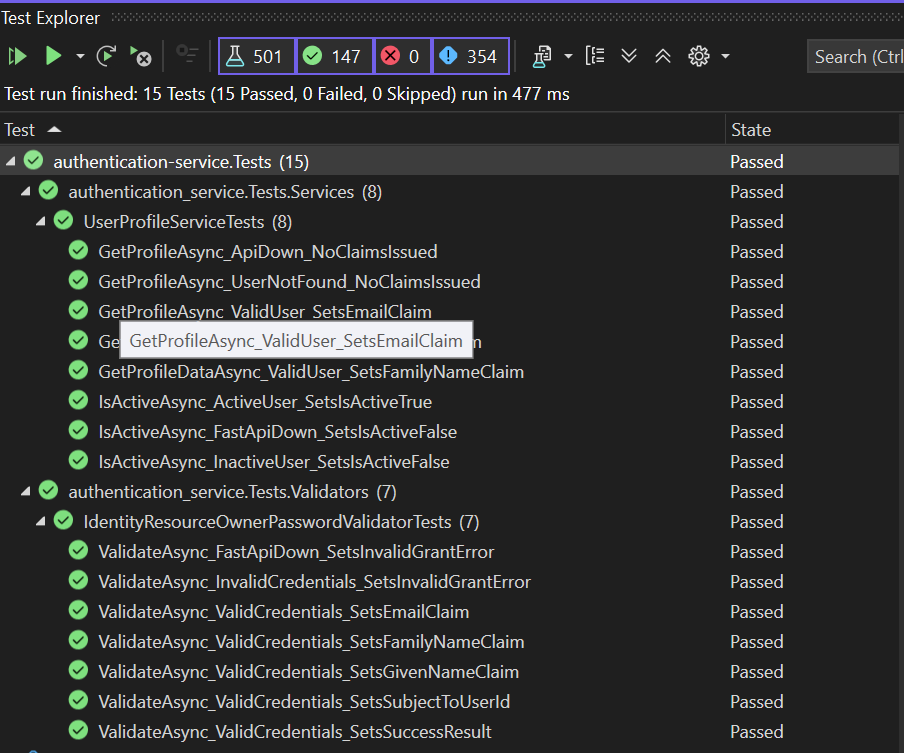
*dotnet test — authentication-service: 15 tests passing*

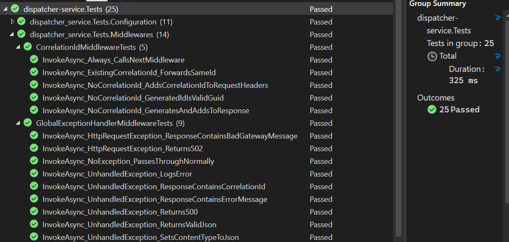
*dotnet test — dispatcher-service: 25 tests passing*

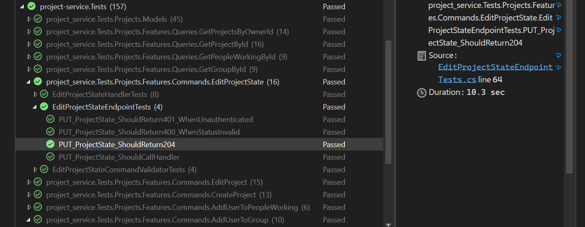
*dotnet test — project-service: 157 tests passing*

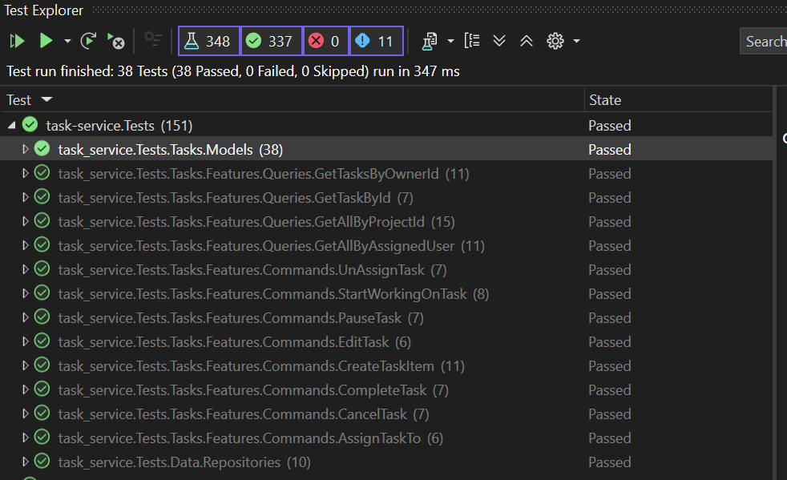
*dotnet test — task-service: 151 tests passing*


*pytest — user-service: 22 tests passing*


*pytest — ai-agent-service: 6 tests passing*

### Observability

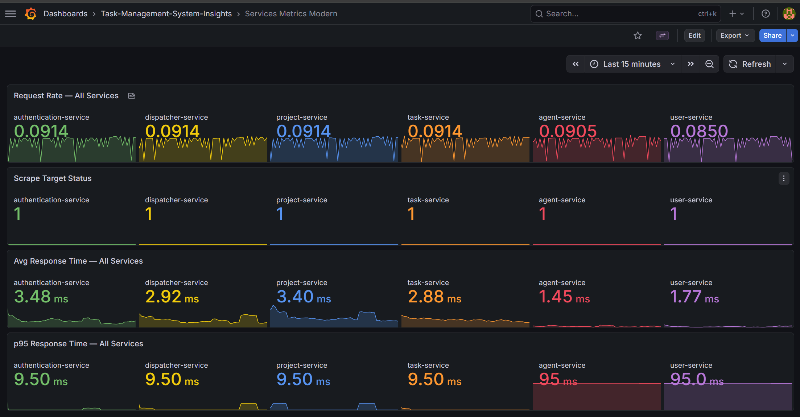
*Grafana — all-service metrics dashboard (Request Rate, Avg Response Time, p95)*


*Grafana — dispatcher-service detailed metrics dashboard*

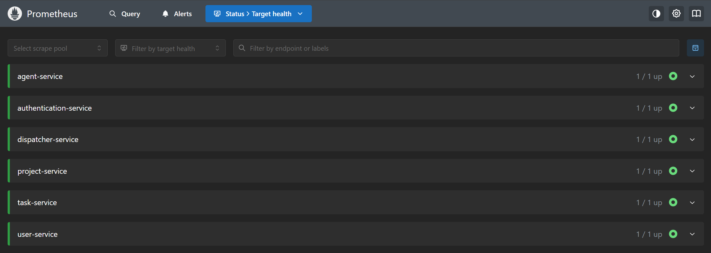
*Prometheus targets page — all services UP*


*RabbitMQ management interface — message rates and queue statistics*

### k6 Load Test Results


*Grafana k6 dashboard — Average Response Time · Error Rate · Throughput · VUs over time*

---

## 📚 References

- Newman, S. (2015). *Building Microservices*. O'Reilly Media.
- Evans, E. (2003). *Domain-Driven Design*. Addison-Wesley.
- Beck, K. (2002). *Test-Driven Development: By Example*. Addison-Wesley.
- Wiggins, A. (2011). *The Twelve-Factor App*. https://12factor.net
- Richardson, L. (2008). *Richardson Maturity Model*. https://martinfowler.com/articles/richardsonMaturityModel.html
- IETF RFC 6749 — *The OAuth 2.0 Authorization Framework*
- IETF RFC 7519 — *JSON Web Token (JWT)*
- [Duende IdentityServer Docs](https://docs.duendesoftware.com)
- [Ocelot API Gateway Docs](https://ocelot.readthedocs.io)
- [k6 Load Testing Docs](https://k6.io/docs)
- [Prometheus Docs](https://prometheus.io/docs)
- [MediatR](https://github.com/jbogard/MediatR) · [Serilog](https://serilog.net) · [FastAPI](https://fastapi.tiangolo.com) · [Ollama](https://ollama.com)
- Vaswani, A., et al. (2017). *Attention is All You Need*. NeurIPS.